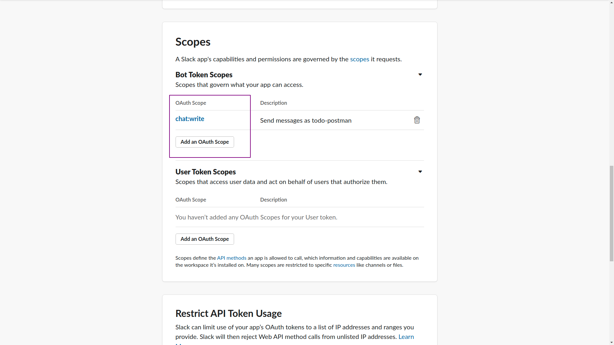
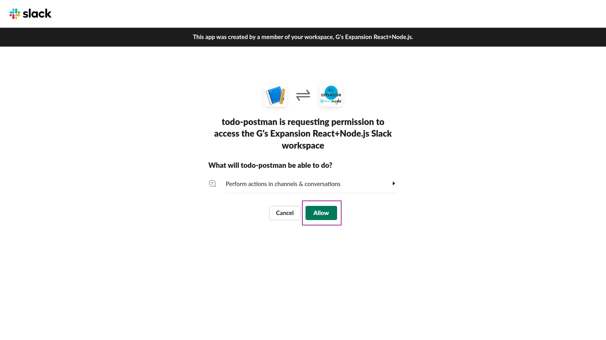
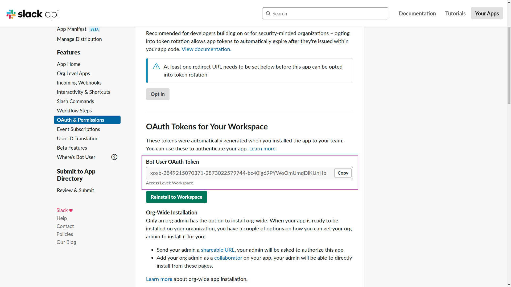

# slack-bot-setup

## Slack と連携するための設定

下記 URL にアクセスする．

[https://api.slack.com/](https://api.slack.com/)

`Create an app` をクリック．

`From scratch` を選択．

「アプリ名（任意）」と「使用するワークスペース」を選択して `Create App` をクリック．

画面が変わるので，左側のメニューから `OAuth & Permissions` → `Scopes` 部分の `Bot Token Scopes` を `chat:write` に設定する．

`Install Workspace` がクリックできるようになっているのでクリックする．画面が変わったら `Allow` をクリック．

画面が変わるので `Bot User Access Token` をメモしておく．

Slack アプリ側で Bot を追加したい channel で「右上のメンバーボタン」→「Integrations」→ `Add an App` の順に進む．

作成したアプリ部分の `Add` ボタンをクリックする．

これで設定は完了．

